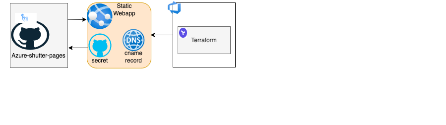

# terraform-module-shutter-static-webapp
Shutter Static web app

### Architecture Diagram

### Prerequisite 
  Needs a [dns-zone-name](https://github.com/hmcts/azure-platform-terraform/blob/bad0b5732456e887cac8e53b78bf0856586e27d9/environments/sbox/sbox.tfvars#L575C1-L575C1) entry for every application.
### Resources

    1) Azure static webapp
    2) CNAME Record `<appname>-shutter` pointing to static webapp url
    3) Add a TXT record to verify the domain. 
    4) Creates a GitHub secret `<appname>_<env>` in the azure-shutter-pages GitHub repository. `-` in <appname> are replaced with an `_`.
    5) Adds custom domain to webapp

test codeowners
